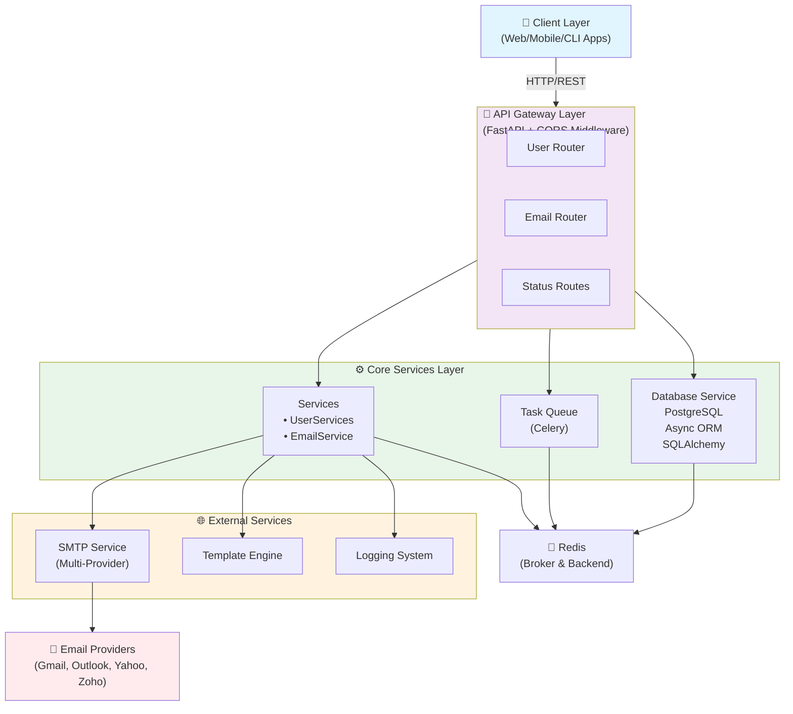
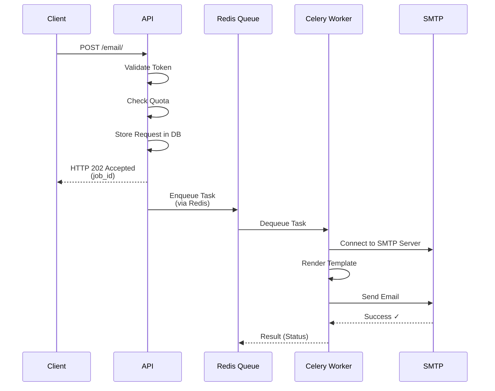
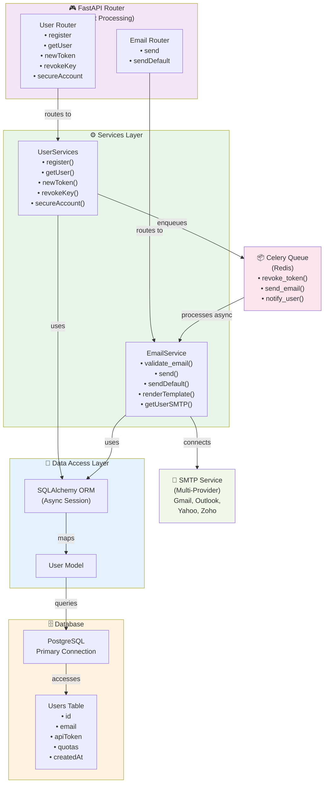
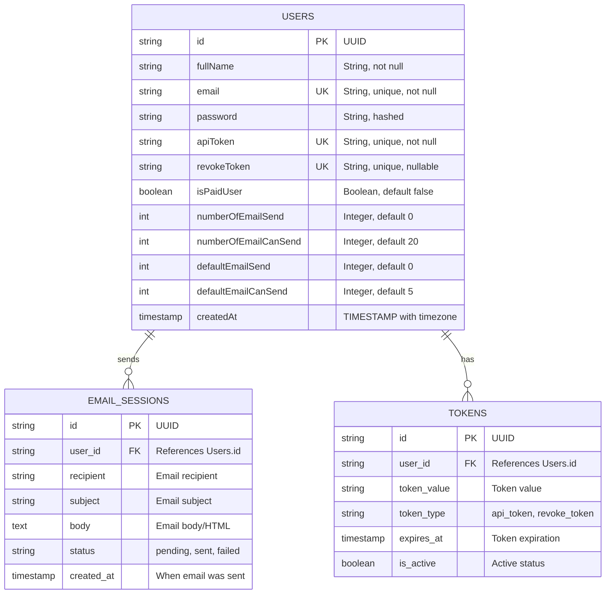
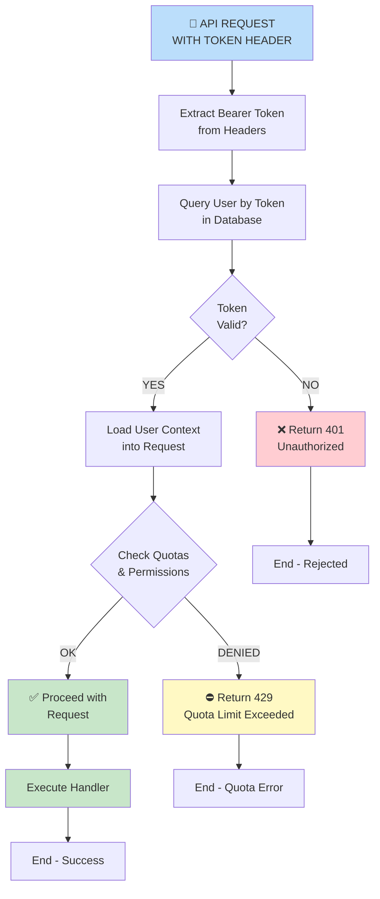
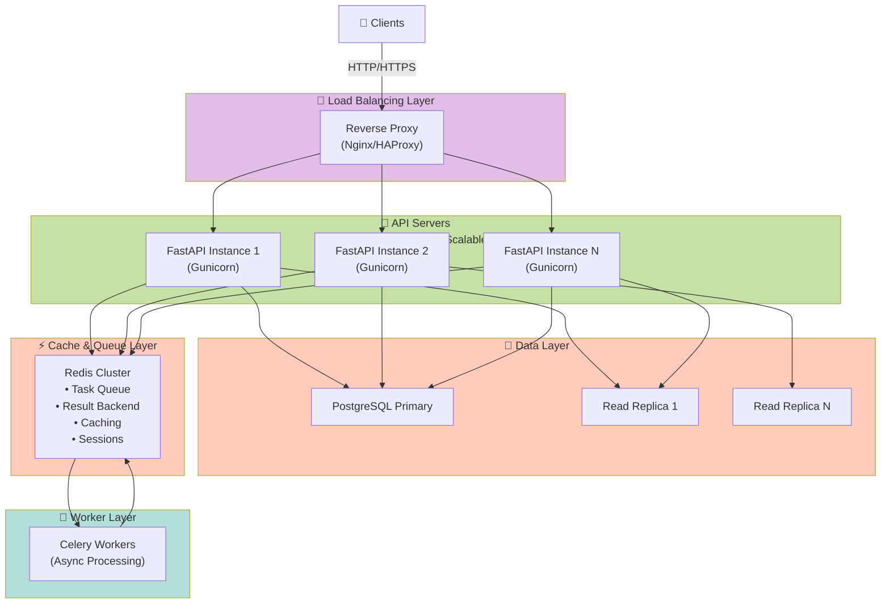

# 📧 MailApix API

> Enterprise-grade async email delivery API with token-based access, quota controls, and template-driven messaging.

<div align="center">


**Status:** 


</div>

---

## 📑 Table of Contents

- [🎯 Overview](#-overview)
- [🚀 Quick Start](#-quick-start)
- [📚 Documentation](#-documentation)
- [✨ Features](#-features)
- [🏗️ System Design](#-system-design)
- [🏗️ Architecture](#-architecture)
- [📊 Project Structure](#-project-structure)
- [🔌 API Endpoints](#-api-endpoints)
- [💾 Technology Stack](#-technology-stack)
- [🎨 Templates](#-templates)
- [🚢 Deployment](#-deployment)
- [🛡️ Security](#-security)
- [📝 License](#-license)

---

## 🎯 Overview

**MailApix API** is a production-ready async email delivery backend built with FastAPI and PostgreSQL. It provides secure token-based access for users to send emails using their own SMTP credentials or the system's default service with quota-based protection.

**Project Status:** ✅ **COMPLETE AND PRODUCTION READY**

- **Build Status:** ✅ SUCCESS
- **Features:** ✅ FULLY IMPLEMENTED (8 endpoints)
- **Documentation:** ✅ COMPLETE (API + Guides)
- **Deployment Ready:** ✅ YES (Docker + Gunicorn)

---

## 🚀 Quick Start

### Prerequisites
- Python 3.10+
- PostgreSQL 12+
- Redis
- Git

### Installation

```bash
# Clone the repository
git clone https://github.com/Sumit0ubey/MailAPIX
cd MailApixAPI

# Create virtual environment
python -m venv .venv
source .venv/bin/activate  # or .venv\Scripts\activate on Windows

# Install dependencies
pip install -r requirements.txt

# Configure environment
# Create .env file with database and email credentials
cp .env.example .env

# Run the application
uvicorn MailApixAPI.main:app --reload

# In another terminal, run Celery
celery -A MailApixAPI.celery_app:celery_app worker --loglevel=info
```

The API will be available at `http://localhost:8000`  
Documentation: `http://localhost:8000/documentation`

---

## 📚 Documentation

### 📖 **Complete API Documentation**
Comprehensive endpoint documentation with request/response examples, validation rules, and error scenarios.

**👉 [View API Documentation](./API_DOCUMENTATION.md)**

### 📋 **This README**
Project overview and quick reference guide.

---

## ✨ Features

<table>
<tr>
<td width="50%">

### 👥 User Management
- ✅ User registration with token delivery
- ✅ Token-based authentication
- ✅ Token refresh via revoke keys
- ✅ Account password protection

</td>
<td width="50%">

### 📧 Email Delivery
- ✅ Send with user SMTP credentials
- ✅ Send with system SMTP fallback
- ✅ Single or multi-recipient support
- ✅ Quota-based rate limiting

</td>
</tr>
<tr>
<td width="50%">

### 🎨 Template System
- ✅ 5 email templates (0-4)
- ✅ Custom HTML support
- ✅ Dynamic variables
- ✅ Fallback text support

</td>
<td width="50%">

### 🔐 Security
- ✅ Token-gated routes
- ✅ Password hardening
- ✅ Quota protection
- ✅ Email validation

</td>
</tr>
</table>

---

## 🏗️ System Design

### 📐 High-Level Architecture



### 🔄 Data Flow Diagram

#### User Registration Flow


#### Email Sending Flow (Async Processing)



#### Token Refresh Flow


### 🔀 Component Interaction Diagram



### 📊 Database Schema Diagram



### 🔐 Authentication & Authorization Flow



### 📈 Scaling Architecture



---

## 🏗️ Architecture

### Clean Layered Architecture

```
┌─────────────────────────────────────┐
│     FastAPI Routers                 │
├─────────────────────────────────────┤
│     Business Logic Layer            │
│     (Services)                      │
├─────────────────────────────────────┤
│     Data Access Layer               │
│     (Repositories + ORM)            │
├─────────────────────────────────────┤
│     Infrastructure                  │
│     (Database, Email, Cache)        │
└─────────────────────────────────────┘
```

### Key Design Principles

- **Async-First:** Non-blocking I/O with asyncio
- **Separation of Concerns:** Clear router → service → repository pattern
- **Dependency Injection:** FastAPI's Depends() for loose coupling
- **Error Handling:** Comprehensive exception handling with proper HTTP codes

---

## 📊 Project Structure

```
MailApixAPI/
│
├── 🎮 Routers/
│   ├── user.py              │ User registration & token management
│   └── email.py             │ Email sending endpoints
│
├── ⚙️ Services/
│   ├── UserServices.py      │ User business logic
│   └── EmailService.py      │ Email delivery logic
│
├── 💾 Controller/
│   ├── database.py          │ Database connection & session
│   ├── models.py            │ SQLAlchemy ORM models
│   ├── schema.py            │ Pydantic request/response schemas
│   └── parser.py            │ Request parsers
│
├── 🎨 Templates/
│   ├── simple.py            │ Plain text template
│   ├── cool.py              │ HTML template 1
│   ├── amazing.py           │ HTML template 2
│   ├── impressive.py        │ HTML template 3
│   └── System/
│       ├── registration.py  │ Registration email
│       ├── packageplan.py   │ Upgrade email
│       └── tokenrevert.py   │ Token reset email
│
├── 📦 Tasks/
│   └── revoke_token_tasks.py │ Celery background tasks
│
├── __init__.py          │ Package initialization
├── main.py              │ FastAPI app initialization
├── celery_app.py        │ Celery task queue setup  
├── utils.py             │ Helper functions
├── logger.py            │ Logging configuration        
│
└── .env                 │ Environment variables
```

---

## 🔌 API Endpoints

### 📥 **User Management** (GET)

| Endpoint | Purpose |
|----------|---------|
| `GET /users/info` | Get user details |
| `GET /users/upgrade` | Request upgrade plan |

### ✍️ **User Creation/Auth** (POST)

| Endpoint | Purpose |
|----------|---------|
| `POST /users/` | Register new user |
| `POST /users/revokeKey/{id}` | Generate revoke key |
| `POST /users/newToken/{id}` | Generate new token |

### 🔄 **User Updates** (PUT)

| Endpoint | Purpose |
|----------|---------|
| `PUT /users/secureAccount/{id}` | Set account password |

### 📧 **Email Sending** (POST)

| Endpoint | Purpose |
|----------|---------|
| `POST /email/` | Send with user SMTP |
| `POST /email/default` | Send with system SMTP |

### Query Parameters

| Parameter | Type | Description |
|-----------|------|-------------|
| `template_id` | int | Template ID (0-4) |
| `company_name` | string | Company name |
| `company_link` | string | Company website |
| `email_title` | string | Email subject |

---

## 💾 Technology Stack

- **Framework:** FastAPI (Python)
- **Database:** PostgreSQL with asyncpg
- **ORM:** SQLAlchemy (async)
- **Validation:** Pydantic v2
- **Email:** SMTP (smtplib)
- **Background Tasks:** Celery + Redis
- **Deployment:** Gunicorn + Uvicorn
- **API Docs:** Swagger/OpenAPI

---

## 🎨 Templates

| ID | Type | Use Case |
|----|------|----------|
| **0** | Plain Text | Simple transactional emails |
| **1** | Professional | Business communications |
| **2** | Modern | Product notifications |
| **3** | Elegant | Marketing campaigns |
| **4** | Custom | Full HTML control |

### Template Variables

All templates support:
- `title` - Email heading
- `content` - Email body
- `company_name` - Company name
- `company_link` - Company website

---

## 🚢 Deployment

### Production Setup

```bash
# Build container
docker build -t mailapix-api .

# Run with Gunicorn
gunicorn -k uvicorn.workers.UvicornWorker MailApixAPI.main:app \
  --workers 4 \
  --bind 0.0.0.0:8000
```

### Environment Variables

```env
# Database
DATABASE_USERNAME=postgres_user
DATABASE_PASSWORD=postgres_password
DATABASE_HOSTNAME=localhost
DATABASE_NAME=mailapix_db

# Email
SYSTEM_EMAIL=you@example.com
SYSTEM_EMAIL_PASSKEY=app_password

# Celery
CELERY_BROKER_URL=redis://localhost:6379/0
CELERY_RESULT_BACKEND=redis://localhost:6379/1
```

### Deployment Checklist

- ✅ Use managed PostgreSQL (RDS, Cloud SQL)
- ✅ Store secrets in environment variables
- ✅ Enable HTTPS at reverse proxy
- ✅ Configure rate limiting
- ✅ Set up database backups
- ✅ Monitor logs and errors
- ✅ Use strong email passwords

---

## 🛡️ Security

### Best Practices

- 🔐 Never commit `.env` files or secrets
- 🔄 Rotate `SYSTEM_EMAIL_PASSKEY` every 90 days
- 🛡️ Use HTTPS in production
- ⛔ Configure CORS explicitly (not `*`)
- 🚦 Implement rate limiting
- 📊 Monitor quota usage
- 🔑 Treat API tokens like passwords
- 📧 Validate email addresses

### Security Policy

Have you found a security vulnerability? Please follow responsible disclosure:

👉 [Security Policy](./SECURITY.md)

---

## 📝 License

This project is licensed under the MIT License - see [LICENSE](./LICENSE) for details.

---

## 👨‍💻 Author

**Sumit Dubey**

- 🔗 GitHub: [https://github.com/Sumit0ubey](https://github.com/Sumit0ubey)
- 📧 Email: sumitdubey810@outlook.com

---

## ⭐ Show Your Support

If you found this project helpful, useful, or interesting, please consider **giving it a star** on GitHub! Your support helps:

- 🚀 Reach more developers who need this solution
- 💪 Motivate continued development and improvements
- 🌟 Build a stronger community around the project

---

## 📚 Additional Resources

- [Contributing Guidelines](./CONTRIBUTING.md)
- [Code of Conduct](./CODE_OF_CONDUCT.md)
- [API Documentation](./API_DOCUMENTATION.md)


