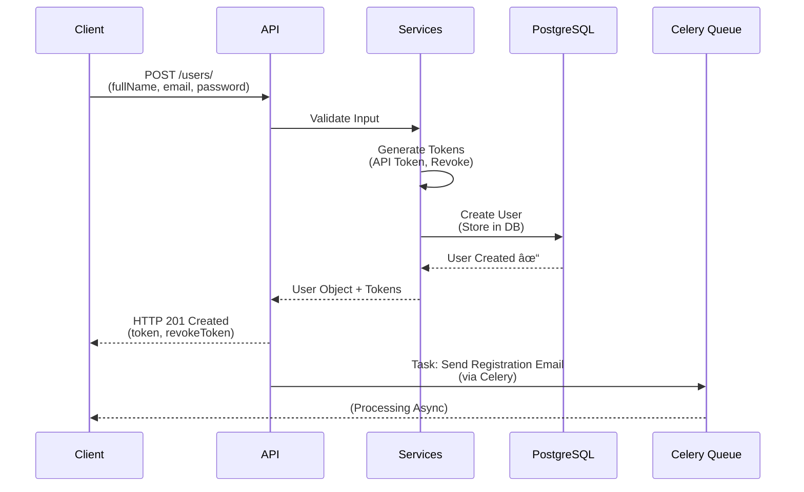
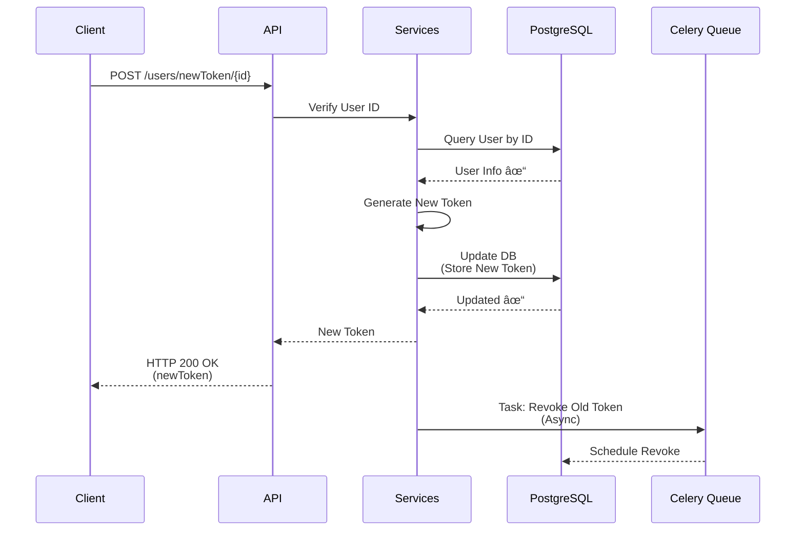
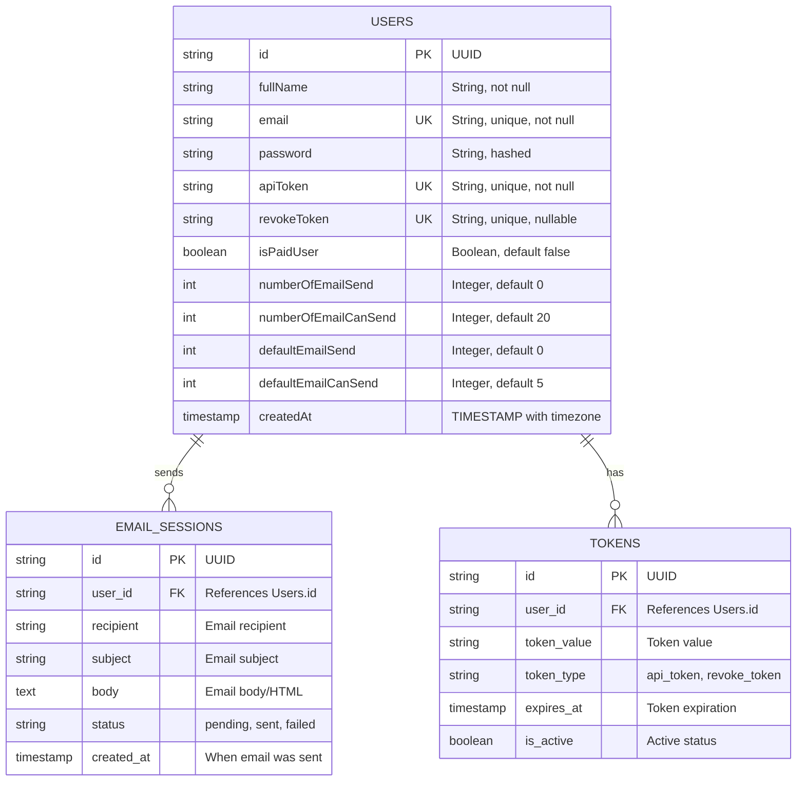

# 📧 MailApix API

> Enterprise-grade async email delivery API with token-based access, quota controls, and template-driven messaging.

<div align="center">


**Status:** 


</div>

---

## 📑 Table of Contents

- [🎯 Overview](#-overview)
- [🚀 Quick Start](#-quick-start)
- [📚 Documentation](#-documentation)
- [✨ Features](#-features)
- [🏗️ System Design](#-system-design)
- [🏗️ Architecture](#-architecture)
- [📊 Project Structure](#-project-structure)
- [🔌 API Endpoints](#-api-endpoints)
- [💾 Technology Stack](#-technology-stack)
- [🎨 Templates](#-templates)
- [🚢 Deployment](#-deployment)
- [🛡️ Security](#-security)
- [📝 License](#-license)

---

## 🎯 Overview

**MailApix API** is a production-ready async email delivery backend built with FastAPI and PostgreSQL. It provides secure token-based access for users to send emails using their own SMTP credentials or the system's default service with quota-based protection.

**Project Status:** ✅ **COMPLETE AND PRODUCTION READY**

- **Build Status:** ✅ SUCCESS
- **Features:** ✅ FULLY IMPLEMENTED (8 endpoints)
- **Documentation:** ✅ COMPLETE (API + Guides)
- **Deployment Ready:** ✅ YES (Docker + Gunicorn)

---

## 🚀 Quick Start

### 🧰 Prerequisites
- 🐍 Python 3.10+
- 🗄️ PostgreSQL 12+
- 🔴 Redis
- 🧬 Git

### ⚙️ Installation

```bash
# Clone the repository
git clone https://github.com/Sumit0ubey/MailAPIX
cd MailApixAPI

# Create virtual environment
python -m venv .venv
source .venv/bin/activate  # or .venv\Scripts\activate on Windows

# Install dependencies
pip install -r requirements.txt

# Configure environment
# Create .env file with database and email credentials
cp .env.example .env

# Run the application
uvicorn MailApixAPI.main:app --reload

# In another terminal, run Celery
celery -A MailApixAPI.celery_app:celery_app worker --loglevel=info
```

The API will be available at `http://localhost:8000`  
Documentation: `http://localhost:8000/documentation`

---

## 📚 Documentation

### 📖 **Complete API Documentation**
Comprehensive endpoint documentation with request/response examples, validation rules, and error scenarios.

**👉 [View API Documentation](./API_DOCUMENTATION.md)**

### 📋 **This README**
Project overview and quick reference guide.

---

## ✨ Features

<table>
<tr>
<td width="50%">

### 👥 User Management
- ✅ User registration with token delivery
- ✅ Token-based authentication
- ✅ Token refresh via revoke keys
- ✅ Account password protection

</td>
<td width="50%">

### 📧 Email Delivery
- ✅ Send with user SMTP credentials
- ✅ Send with system SMTP fallback
- ✅ Single or multi-recipient support
- ✅ Quota-based rate limiting

</td>
</tr>
<tr>
<td width="50%">

### 🎨 Template System
- ✅ 5 email templates (0-4)
- ✅ Custom HTML support
- ✅ Dynamic variables
- ✅ Fallback text support

</td>
<td width="50%">

### 🔐 Security
- ✅ Token-gated routes
- ✅ Password hardening
- ✅ Quota protection
- ✅ Email validation

</td>
</tr>
</table>

---

## 🏗️ System Design

### 📐 High-Level Architecture

```mermaid
graph TB
    Client["👥 Client Layer<br/>(Web/Mobile/CLI Apps)"]
    
    subgraph API["🚀 API Gateway Layer<br/>(FastAPI + CORS Middleware)"]
        UserRouter["User Router"]
        EmailRouter["Email Router"]
        StatusRouter["Status Routes"]
    end
    
    subgraph Core["⚙️ Core Services Layer"]
        Services["Services<br/>• UserServices<br/>• EmailService"]
        Queue["Task Queue<br/>(Celery)"]
        DB["Database Service<br/>PostgreSQL<br/>Async ORM<br/>SQLAlchemy"]
    end
    
    Redis["🔴 Redis<br/>(Broker & Backend)"]
    
    subgraph Ext["🌐 External Services"]
        SMTP["SMTP Service<br/>(Multi-Provider)"]
        Templates["Template Engine"]
        Logging["Logging System"]
    end
    
    EmailProviders["📧 Email Providers<br/>(Gmail, Outlook, Yahoo, Zoho)"]
    
    Client -->|HTTP/REST| API
    API --> Services
    API --> Queue
    API --> DB
    Services --> Redis
    Queue --> Redis
    DB --> Redis
    Services --> SMTP
    Services --> Templates
    Services --> Logging
    SMTP --> EmailProviders
    
    style Client fill:#e1f5ff
    style API fill:#f3e5f5
    style Core fill:#e8f5e9
    style Ext fill:#fff3e0
    style EmailProviders fill:#ffebee
```



### 🔄 Data Flow Diagram

#### 👤 User Registration Flow



#### 📨 Email Sending Flow (Async Processing)


#### 🔑 Token Refresh Flow



### 🔀 Component Interaction Diagram

```mermaid
graph TB
    subgraph Router["🎮 FastAPI Router<br/>(Request Processing)"]
        UserR["User Router<br/>• register<br/>• getUser<br/>• newToken<br/>• revokeKey<br/>• secureAccount"]
        EmailR["Email Router<br/>• send<br/>• sendDefault"]
    end
    
    subgraph Services["⚙️ Services Layer"]
        UserServ["UserServices<br/>• register()<br/>• getUser()<br/>• newToken()<br/>• revokeKey()<br/>• secureAccount()"]
        EmailServ["EmailService<br/>• validate_email()<br/>• send()<br/>• sendDefault()<br/>• renderTemplate()<br/>• getUserSMTP()"]
    end
    
    subgraph Data["💾 Data Access Layer"]
        ORM["SQLAlchemy ORM<br/>(Async Session)"]
        Model["User Model"]
    end
    
    subgraph DB["🗄️ Database"]
        DBConn["PostgreSQL<br/>Primary Connection"]
        Table["Users Table<br/>• id<br/>• email<br/>• apiToken<br/>• quotas<br/>• createdAt"]
    end
    
    Queue["📦 Celery Queue<br/>(Redis)<br/>• revoke_token()<br/>• send_email()<br/>• notify_user()"]
    
    SMTP["📧 SMTP Service<br/>(Multi-Provider)<br/>Gmail, Outlook,<br/>Yahoo, Zoho"]
    
    UserR -->|routes to| UserServ
    EmailR -->|routes to| EmailServ
    UserServ -->|uses| ORM
    EmailServ -->|uses| ORM
    ORM -->|maps| Model
    Model -->|queries| DBConn
    DBConn -->|accesses| Table
    UserServ -->|enqueues| Queue
    EmailServ -->|connects| SMTP
    Queue -->|processes async| EmailServ
    
    style Router fill:#f3e5f5
    style Services fill:#e8f5e9
    style Data fill:#e3f2fd
    style DB fill:#fff3e0
    style Queue fill:#fce4ec
    style SMTP fill:#f1f8e9
```



### 📊 Database Schema Diagram



### 🔐 Authentication & Authorization Flow

```mermaid
flowchart TD
    Start["🔐 API REQUEST<br/>WITH TOKEN HEADER"] --> Extract["Extract Bearer Token<br/>from Headers"]
    Extract --> Query["Query User by Token<br/>in Database"]
    Query --> Check{Token<br/>Valid?}
    
    Check -->|YES| Load["Load User Context<br/>into Request"]
    Check -->|NO| Reject["❌ Return 401<br/>Unauthorized"]
    
    Load --> CheckQuota{Check Quotas<br/>& Permissions}
    
    CheckQuota -->|OK| Proceed["✅ Proceed with<br/>Request"]
    CheckQuota -->|DENIED| QuotaError["â›” Return 429<br/>Quota Limit Exceeded"]
    
    Proceed --> Success["Execute Handler"]
    Reject --> End1["End - Rejected"]
    QuotaError --> End2["End - Quota Error"]
    Success --> End3["End - Success"]
    
    style Start fill:#bbdefb
    style Proceed fill:#c8e6c9
    style Reject fill:#ffcdd2
    style QuotaError fill:#fff9c4
    style Success fill:#c8e6c9
```



### 📈 Scaling Architecture

```mermaid
graph TB
    subgraph LB["🔄 Load Balancing Layer"]
        Proxy["Reverse Proxy<br/>(Nginx/HAProxy)"]
    end
    
    subgraph API["🚀 API Servers<br/>(Horizontally Scalable)"]
        Instance1["FastAPI Instance 1<br/>(Gunicorn)"]
        Instance2["FastAPI Instance 2<br/>(Gunicorn)"]
        InstanceN["FastAPI Instance N<br/>(Gunicorn)"]
    end
    
    subgraph Data["💾 Data Layer"]
        PG["PostgreSQL Primary"]
        PGRead1["Read Replica 1"]
        PGRead2["Read Replica N"]
    end
    
    subgraph Cache["âš¡ Cache & Queue Layer"]
        Redis["Redis Cluster<br/>• Task Queue<br/>• Result Backend<br/>• Caching<br/>• Sessions"]
    end
    
    subgraph Workers["🔧 Worker Layer"]
        Celery["Celery Workers<br/>(Async Processing)"]
    end
    
    Client["👥 Clients"]
    
    Client -->|HTTP/HTTPS| Proxy
    Proxy --> Instance1
    Proxy --> Instance2
    Proxy --> InstanceN
    
    Instance1 --> PG
    Instance2 --> PG
    InstanceN --> PG
    
    Instance1 --> PGRead1
    Instance2 --> PGRead2
    InstanceN --> PGRead1
    
    Instance1 --> Redis
    Instance2 --> Redis
    InstanceN --> Redis
    
    Redis --> Celery
    Celery --> Redis
    
    style LB fill:#e1bee7
    style API fill:#c5e1a5
    style Data fill:#ffccbc
    style Cache fill:#ffccbc
    style Workers fill:#b2dfdb
```



---

## 🏗️ Architecture

### Clean Layered Architecture

```
┌─────────────────────────────────────┐
│     FastAPI Routers                 │
├─────────────────────────────────────┤
│     Business Logic Layer            │
│     (Services)                      │
├─────────────────────────────────────┤
│     Data Access Layer               │
│     (Repositories + ORM)            │
├─────────────────────────────────────┤
│     Infrastructure                  │
│     (Database, Email, Cache)        │
└─────────────────────────────────────┘
```

### Key Design Principles

- **Async-First:** Non-blocking I/O with asyncio
- **Separation of Concerns:** Clear router → service → repository pattern
- **Dependency Injection:** FastAPI's Depends() for loose coupling
- **Error Handling:** Comprehensive exception handling with proper HTTP codes

---

## 📊 Project Structure

```
MailApixAPI/
│
├── 🎮 Routers/
│   ├── user.py              │ User registration & token management
│   └── email.py             │ Email sending endpoints
│
├── ⚙️ Services/
│   ├── UserServices.py      │ User business logic
│   └── EmailService.py      │ Email delivery logic
│
├── 💾 Controller/
│   ├── database.py          │ Database connection & session
│   ├── models.py            │ SQLAlchemy ORM models
│   ├── schema.py            │ Pydantic request/response schemas
│   └── parser.py            │ Request parsers
│
├── 🎨 Templates/
│   ├── simple.py            │ Plain text template
│   ├── cool.py              │ HTML template 1
│   ├── amazing.py           │ HTML template 2
│   ├── impressive.py        │ HTML template 3
│   └── System/
│       ├── registration.py  │ Registration email
│       ├── packageplan.py   │ Upgrade email
│       └── tokenrevert.py   │ Token reset email
│
├── 📦 Tasks/
│   └── revoke_token_tasks.py │ Celery background tasks
│
├── __init__.py          │ Package initialization
├── main.py              │ FastAPI app initialization
├── celery_app.py        │ Celery task queue setup  
├── utils.py             │ Helper functions
├── logger.py            │ Logging configuration        
│
└── .env                 │ Environment variables
```

---

### 🔌 API Endpoints

### 📥 **User Management** (GET)

| Endpoint | Purpose |
|----------|---------|
| `📍 GET /users/info` | Get user details |
| `📍 GET /users/upgrade` | Request upgrade plan |

### ✍️ **User Creation/Auth** (POST)

| Endpoint | Purpose |
|----------|---------|
| `📍 POST /users/` | Register new user |
| `📍 POST /users/revokeKey/{id}` | Generate revoke key |
| `📍 POST /users/newToken/{id}` | Generate new token |

### 🔄 **User Updates** (PUT)

| Endpoint | Purpose |
|----------|---------|
| `📍 PUT /users/secureAccount/{id}` | Set account password |

### 📧 **Email Sending** (POST)

| Endpoint | Purpose |
|----------|---------|
| `📍 POST /email/` | Send with user SMTP |
| `📍 POST /email/default` | Send with system SMTP |

### 📋 Query Parameters

| Parameter | Type | Description |
|-----------|------|-------------|
| 🏷️ `template_id` | int | Template ID (0-4) |
| 🏢 `company_name` | string | Company name |
| 🔗 `company_link` | string | Company website |
| 📄 `email_title` | string | Email subject |

---

## 💾 Technology Stack

- 🐍 **Framework:** FastAPI (Python)
- 🗄️ **Database:** PostgreSQL with asyncpg
- 🔗 **ORM:** SQLAlchemy (async)
- ✅ **Validation:** Pydantic v2
- 📧 **Email:** SMTP (smtplib)
- 📬 **Background Tasks:** Celery + Redis
- 🚀 **Deployment:** Gunicorn + Uvicorn
- 📚 **API Docs:** Swagger/OpenAPI

---

## 🎨 Templates

| ID | Type | Use Case |
|----|------|----------|
| **0️⃣** | Plain Text | Simple transactional emails |
| **1️⃣** | Professional | Business communications |
| **2️⃣** | Modern | Product notifications |
| **3️⃣** | Elegant | Marketing campaigns |
| **4️⃣** | Custom | Full HTML control |

### 🏷️ Template Variables

All templates support:
- `title` - 📝 Email heading
- `content` - 📄 Email body
- `company_name` - 🏢 Company name
- `company_link` - 🔗 Company website

---

## 🚢 Deployment

### 🐳 Production Setup

```bash
# Build container
docker build -t mailapix-api .

# Run with Gunicorn
gunicorn -k uvicorn.workers.UvicornWorker MailApixAPI.main:app \
  --workers 4 \
  --bind 0.0.0.0:8000
```

### 🔐 Environment Variables

```env
# 🗄️ Database
DATABASE_USERNAME=postgres_user
DATABASE_PASSWORD=postgres_password
DATABASE_HOSTNAME=localhost
DATABASE_NAME=mailapix_db

# 📧 Email
SYSTEM_EMAIL=you@example.com
SYSTEM_EMAIL_PASSKEY=app_password

# 📬 Celery
CELERY_BROKER_URL=redis://localhost:6379/0
CELERY_RESULT_BACKEND=redis://localhost:6379/1
```

### ✅ Deployment Checklist

- ✅ Use managed PostgreSQL (RDS, Cloud SQL)
- ✅ Store secrets in environment variables
- ✅ Enable HTTPS at reverse proxy
- ✅ Configure rate limiting
- ✅ Set up database backups
- ✅ Monitor logs and errors
- ✅ Use strong email passwords

---

## 🛡️ Security

### 🔒 Best Practices

- 🔐 Never commit `.env` files or secrets
- 🔄 Rotate `SYSTEM_EMAIL_PASSKEY` every 90 days
- 🛡️ Use HTTPS in production
- â›” Configure CORS explicitly (not `*`)
- 🚦 Implement rate limiting
- 📊 Monitor quota usage
- 🔑 Treat API tokens like passwords
- 📧 Validate email addresses

### 📋 Security Policy

Have you found a security vulnerability? Please follow responsible disclosure:

👉 [Security Policy](./SECURITY.md)

---

## 📝 License

This project is licensed under the MIT License - see [LICENSE](./LICENSE) for details.

---

## 👨‍💻 Author

**Sumit Dubey**

- 🔗 GitHub: [https://github.com/Sumit0ubey](https://github.com/Sumit0ubey)
- 📧 Email: sumitdubey810@outlook.com

---

## ⭐ Show Your Support

If you found this project helpful, useful, or interesting, please consider **giving it a star** on GitHub! Your support helps:

- 🚀 Reach more developers who need this solution
- 💪 Motivate continued development and improvements
- 🌟 Build a stronger community around the project

---

## 📚 Additional Resources

- 🤝 [Contributing Guidelines](./CONTRIBUTING.md)
- 📜 [Code of Conduct](./CODE_OF_CONDUCT.md)
- 📖 [API Documentation](./API_DOCUMENTATION.md)


