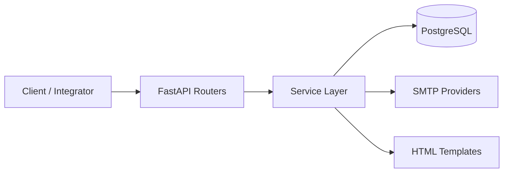

# 📧 MailApix API

> Enterprise-style async email delivery API with token-based access, quota controls, and template-driven messaging.

<div align="center">

<a href="https://github.com/Sumit0ubey/MailAPIX">
    
</a>

<br/>


<br/>

[](./CONTRIBUTING.md)
[](./SECURITY.md)
[](./CODE_OF_CONDUCT.md)
[](./LICENSE)

<br/>

<a href="#-getting-started"></a>
<a href="#-api-summary"></a>
<a href="#-deployment"></a>

</div>

<div align="center">

### ⚡ Built for Reliable Transactional & Product Emails

From user onboarding emails to system-level notifications, MailApix API delivers secure, template-driven messaging with async performance and operational control.

</div>

| Capability Card | Details |
|---|---|
| 🏢 **Platform Readiness** | Async API design, clean module boundaries, deployment-ready process model |
| 🔐 **Security Model** | Token-gated routes, account password hardening, quota-based protection |
| 📧 **Delivery Engine** | User SMTP mode + system SMTP mode, single/multi-recipient support |
| 🎨 **Template System** | Built-in template IDs (`0..4`) with support for full custom HTML payload |
| 📈 **Scalable Runtime** | ASGI stack with Gunicorn + Uvicorn workers for production environments |
| 🚀 **Operations** | Environment-first configuration and deployment-friendly process entrypoint |

| Snapshot | Value |
|---|---|
| API Style | REST + Async I/O |
| Documentation Endpoint | `/documentation` |
| Database Engine | PostgreSQL (`asyncpg`) |
| Worker Model | `gunicorn -k uvicorn.workers.UvicornWorker` |

Async email service backend built with **FastAPI + PostgreSQL + SMTP**, designed for token-based user access, quota-controlled email sending, and reusable HTML templates.

---

## 📌 Table of Contents

- [✨ Overview](#-overview)
- [🚀 Why MailApix API?](#-why-mailapix-api)
- [🧩 Features](#-features)
- [🏗 Architecture](#-architecture)
- [🛠 Tech Stack](#-tech-stack)
- [📦 Project Structure](#-project-structure)
- [⚙️ Getting Started](#-getting-started)
- [🌩 Environment Variables](#-environment-variables)
- [📘 API Summary](#-api-summary)
- [🎨 Templates](#-templates)
- [🚢 Deployment](#-deployment)
- [🧪 Security & Operational Notes](#-security--operational-notes)
- [🤝 Contributing](#-contributing)
- [🛡 Security Policy](#-security-policy)
- [📜 Code of Conduct](#-code-of-conduct)
- [📄 License](#-license)
- [👨‍💻 Author](#-author)

---

## ✨ Overview

**MailApix API** provides a production-oriented email backend where users can:

- register and receive credentials/token via email,
- send emails using either their own SMTP credentials or system credentials,
- use built-in templates (or custom HTML),
- manage token reset and account security.

The service is asynchronous, DB-backed, and separated into routers, service layer, and controllers for maintainability.

---

## 🚀 Why MailApix API?

- **Async-first backend** with FastAPI + SQLAlchemy async engine.
- **Quota protection** through per-user send limits.
- **Flexible delivery mode**: user SMTP credentials or system email fallback.
- **Template-driven messaging** with optional custom HTML.
- **Deployable stack** with Gunicorn + Uvicorn worker support.

---

## 🧩 Features

### User & Access
- ✅ User registration with token delivery over email
- ✅ Token refresh endpoint
- ✅ Optional account password hardening

### Email Delivery
- ✅ Send from user-provided SMTP credentials
- ✅ Send from system-configured SMTP credentials
- ✅ Single or multiple recipient support (`sendTo`)

### Template Support
- ✅ Plain text mode
- ✅ Prebuilt HTML templates
- ✅ Custom HTML mode

---

## 🏗 Architecture



---

## 🛠 Tech Stack

- **Backend**: FastAPI, Starlette, Uvicorn
- **Database**: PostgreSQL + `asyncpg`
- **ORM**: SQLAlchemy (async)
- **Validation**: Pydantic v2
- **Email**: SMTP (`smtplib`-based service layer)
- **Deployment**: Gunicorn + UvicornWorker

---

## 📦 Project Structure

```text
MailApixAPI/
├── main.py
├── utils.py
├── Controller/
│   ├── database.py
│   ├── models.py
│   ├── parser.py
│   └── schema.py
├── Routers/
│   ├── user.py
│   └── email.py
├── Services/
│   ├── EmailService.py
│   └── UserServices.py
└── Templates/
    ├── simple.py
    ├── cool.py
    ├── amazing.py
    ├── impressive.py
    └── System/
        ├── registration.py
        ├── packageplan.py
        └── tokenrevert.py
```

---

## ⚙️ Getting Started

### 1) Clone and install

```bash
git clone <your-repo-url>
cd EmaiServiceApp

python -m venv .venv
# Windows
.venv\Scripts\activate
# macOS/Linux
source .venv/bin/activate

pip install -r requirements.txt
```

### 2) Configure environment

Create a `.env` file in project root (see variables below).

### 3) Run locally

```bash
uvicorn MailApixAPI.main:app --reload
```

Default local URL: `http://127.0.0.1:8000`

---

## 🌩 Environment Variables

```env
# Database
DATABASE_USERNAME=postgres_user
DATABASE_PASSWORD=postgres_password
DATABASE_HOSTNAME=localhost
DATABASE_NAME=mailapix_db

# System email account used by /email/default and system notifications
SYSTEM_EMAIL=you@example.com
SYSTEM_EMAIL_PASSKEY=your_app_password
```

> Note: database connection is created with `ssl=require` in the current code.

---

## 📘 API Summary

### Root
- `GET /` → service metadata

### User routes (`/users`)
- `POST /users/` → register user
- `GET /users/info` → fetch user info (`user_id` header)
- `GET /users/upgrade` → send plan email (`user_id` header)
- `POST /users/newToken/{id}` → rotate API token (`token` header)
- `PUT /users/secureAccount{id}` → set/rotate account password (`token` header)

### Email routes (`/email`)
- `POST /email/` → send using user SMTP passkey (`token` header)
- `POST /email/default` → send using system SMTP credentials (`token` header)

### Optional query parameters for email endpoints
- `template_id` (`0..4`)
- `company_name`
- `company_link`
- `email_title`

---

## 🎨 Templates

| `template_id` | Mode | Description |
|---|---|---|
| `0` | Plain | Text-focused email |
| `1` | HTML | Prebuilt template |
| `2` | HTML | Prebuilt template |
| `3` | HTML | Prebuilt template |
| `4` | Custom | Uses `customHtml` from request body |

---

## 🚢 Deployment

This repo already includes a production Procfile:

```bash
web: gunicorn -k uvicorn.workers.UvicornWorker MailApixAPI.main:app
```

Recommended production setup:
- managed PostgreSQL instance,
- secure env var injection,
- HTTPS termination at reverse proxy,
- SMTP provider app-password or API-key based auth.

---

## 🧪 Security & Operational Notes

- Keep all credentials in environment variables.
- Rotate `SYSTEM_EMAIL_PASSKEY` periodically.
- Enforce stricter CORS than `*` for production.
- Add per-route rate limiting middleware for abuse protection.
- Monitor quota counters (`numberOfEmailSend`, `defaultEmailTimeUsed`).

---

## 🤝 Contributing

Contributions are welcome.

- Read contribution workflow: [CONTRIBUTING.md](CONTRIBUTING.md)

---

## 🛡 Security Policy

For responsible disclosure and security response process:

- Read policy: [SECURITY.md](SECURITY.md)

---

## 📜 Code of Conduct

Community participation standards are documented here:

- Read code of conduct: [CODE_OF_CONDUCT.md](CODE_OF_CONDUCT.md)

---

## 📄 License

This project is licensed under the MIT License.

- Full text: [LICENSE](LICENSE)

---

## 👨‍💻 Author

**Sumit Dubey**  
GitHub: https://github.com/Sumit0ubey
